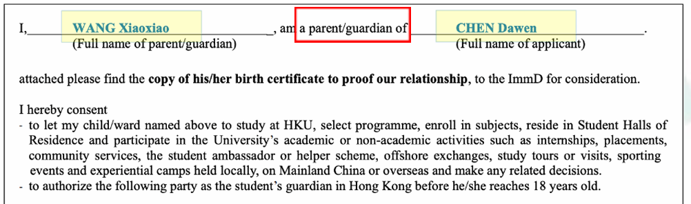
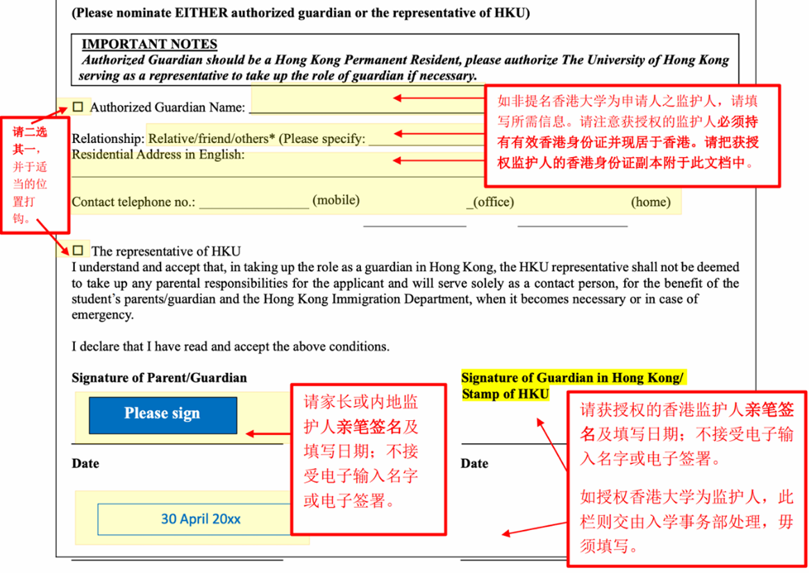
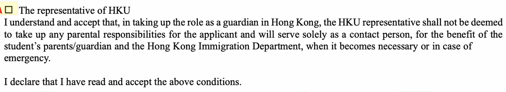
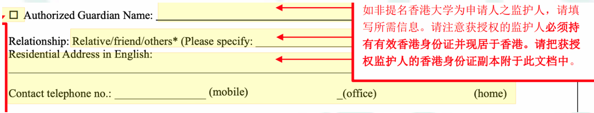

# Letter of Guardian Nomination 填写指南

适用人群：开学当天（2025 年 9 月 1 日）仍未成年的同学。

填写方式：打印后填写、签名，再扫描成 PDF 上传。

填写流程：全部使用大写字母，并在符合的方框中打勾以及划去不符合的内容。

## 1. 填写申请人及监护人

用大写字母，在第一个空格中填写父母或内地监护人的姓名，第二个空格中填写自己的姓名。注意，要划去红框两者中不适用的一项（即若为父母，则划去 guardian 一项，反之亦然）

<figure><figcaption></figcaption></figure>

## 2. 选择在港监护人，以下这两项只需要勾其中一个就可以了～

<figure><figcaption></figcaption></figure>

如申请人在开学当天仍为 18 岁以下人士，便必须提名一位香港永久性居民成为监护人，才能申请学生签证在香港就读。

如申请人在香港没有亲属或提名人，便可提名香港大学为在港监护人，但香港大学不会担当家长或亲属的角色及担任其责任。只会在紧急情况下作为申请人与入境处之间的联系人。

如在港有永久性居民作为监护人，在第一个小方框打钩，填写好在港监护人的姓名、联系方式、住址，并阐明关系（划去 relationship 中不适当的选项）即可。

注意要用大写! 

<figure><figcaption></figcaption></figure>

## 3. 签名

这里是由父母或内地监护人进行签名并填写日期，注意要划去不适用的选项

.jpeg>)

这里是由在港监护人进行签名，或在上传文件之后，由港大盖章。即如果是选择提名港大作为在港监护人的同学，这一项不需要填写。

.jpeg>)

> 编写人：B27 冯雪菲

***

_Licensed under CC BY-NC-ND 4.0. Copyright © 2026 HKURIC. All Rights Reserved._ _未经许可，禁止演绎、修改或商业用途。_
