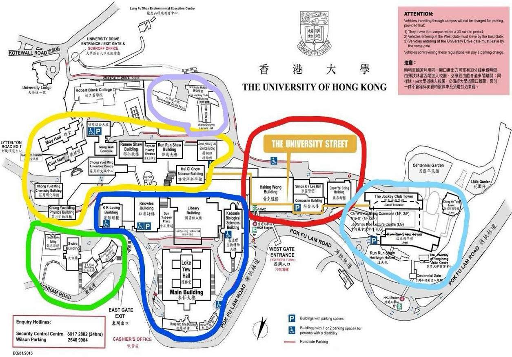
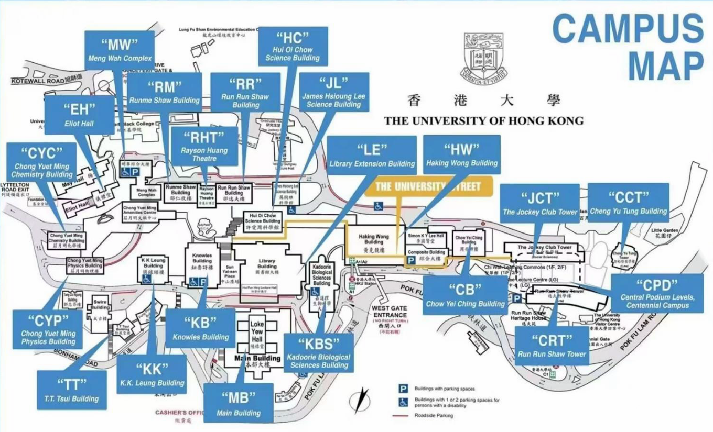
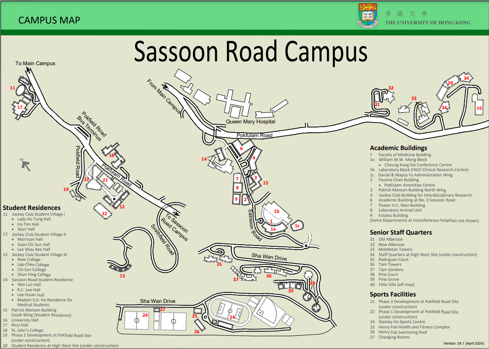

# 港大主要教学区中英文对照



@港大 RIC 锐克 2025 Rights and Interests Committee 新生 QQ 群号：982312228

同学们你好呀！香港大学内地本科生权益保障组 Rights and Interests Committee (RIC) 很高兴与你相遇！我们的职能有：权益维护 | 学术生活干货分享 | 丰富多彩的福利与活动。

欢迎关注我们的微信公众号 港大 RIC 锐克 及同名小红书账号，获取更多实用信息，探索精彩港大生活！此外，我们还有 RIC 杂货铺 app 与 RIC 选课平台 ( [https://richku.com/](https://richku.com/) )，内含查看 ddl、搜索课程评价等诸多功能，快来一探究竟！

同时为了更加及时、准确地解决大家的疑问，RIC 开通了 B28 新生 QQ 群：982312228，也可以扫描文件上方二维码，有靠谱学长学姐热情解答各种问题，欢迎加入！

***

### 本部校园和百周年校园教学楼

| **代号 (Code)** | **英文名称 (English Name)**               | **中文名称 (Chinese Name)** |
| ------------- | ------------------------------------- | ----------------------- |
| CYM           | Chong Yuet Ming Amenities Centre      | 庄月明文娱中心                 |
| CYC           | Chong Yuet Ming Chemistry Building    | 庄月明化学楼                  |
| CYP           | Chong Yuet Ming Physics Building      | 庄月明物理楼                  |
| EH            | Eliot Hall                            | 仪礼堂                     |
| RM            | Rumme Shaw Building                   | 邵仁梅楼                    |
| HC            | Hoi Oi Chow Science Building          | 许爱周科学馆                  |
| MW            | Meng Wah Complex                      | 明华综合大楼                  |
| RR            | Run Run Shaw Building                 | 邵逸夫楼                    |
| GH            | Graduate House                        | 研究生堂                    |
| WLGH          | Wang Gungwu Theatre (Graduate House)  | 王赓武讲堂                   |
| CB            | Chow Yei Ching Building               | 周亦卿楼                    |
| HW            | Haking Wong Building                  | 黄克竞楼                    |
| JCT/CJT       | The Jockey Club Tower                 | 赛马会教学楼                  |
| RRS/CRT       | Run Run Shaw Tower                    | 逸夫教学楼                   |
| CPD           | Central Podium Levels                 | 百周年校园                   |
| CCT           | Cheng Yu Tung Tower                   | 郑裕彤教学楼                  |
| HHY           | Hung Hing Ying Building               | 孔庆荧楼                    |
| KA/KBSB       | Kadoorie Biological Sciences Building | 嘉道理生物科学大楼               |
| KB            | Knowles Building                      | 钮鲁诗楼                    |
| LE            | Library Extension Building            | 香港大学图书馆延伸大楼             |
| KK            | K.K.Leung Building                    | 梁球锯楼                    |
| MB            | Main Building                         | 主楼                      |
| PSL           | Pao Siu Loong Building                | 包兆龙楼                    |
| TT/TS         | T.T.Tsui Building                     | 徐展堂楼                    |

> 注意： 本部校园内课间步行十分钟基本可以来往于各教学楼课室。如果拖堂/路上拥挤，可能需要快走或小跑。

***

### 校园地图

<figure><figcaption></figcaption></figure>

<figure><figcaption></figcaption></figure>

同学们亦可在 Estates Office 官网下载校园地图：

[https://www.estates.hku.hk/campus-information/campus-map-transport/hku-campus-map](https://www.estates.hku.hk/campus-information/campus-map-transport/hku-campus-map)

***

### 沙宣道校园 (Sassoon Road Campus)

* #### 医学院教学楼（供稿：邱泽宇 B21）
* FMM: FMM William M. W. Mong Block (蒙民伟楼)
* QMH: Queen Mary Hospital (玛丽医院)
* HKJC: Jockey Club Building for Interdisciplinary Research (香港赛马会跨学科研究大楼)
* QTLT: Block T Lecture Theatre (玛丽医院 Block T 讲堂)

> 注：医学院各教室列表可在此链接查询：
>
> [https://www.med.hku.hk/medicine/staff/booking/getvenues2.php](https://www.med.hku.hk/medicine/staff/booking/getvenues2.php)

#### 牙医学院教学楼（供稿：季李祺 B21）

* PPDH: Prince Philip Dental Hospital (菲腊牙科医院)

沙宣道地图：

<figure><figcaption></figcaption></figure>

***

#### 重要提醒

> 注： 医学院、牙医学院与本部校区均有一段距离，普通的 10 分钟课间不足以抵达相关的目的地，请同学们合理安排课程，以免误课。

***

想要加入我们来一同为内地本科生维权、谋福利嘛？快快关注我们的微信公众号“港大 RIC 锐克”吧！我们将在九月发布招新信息呦\~

@港大 RIC 锐克 2025 Rights and Interests Committee 新生 QQ 群号: 982312228

***

_Licensed under CC BY-NC-ND 4.0. Copyright © 2026 HKURIC. All Rights Reserved._ _未经许可，禁止演绎、修改或商业用途。_
