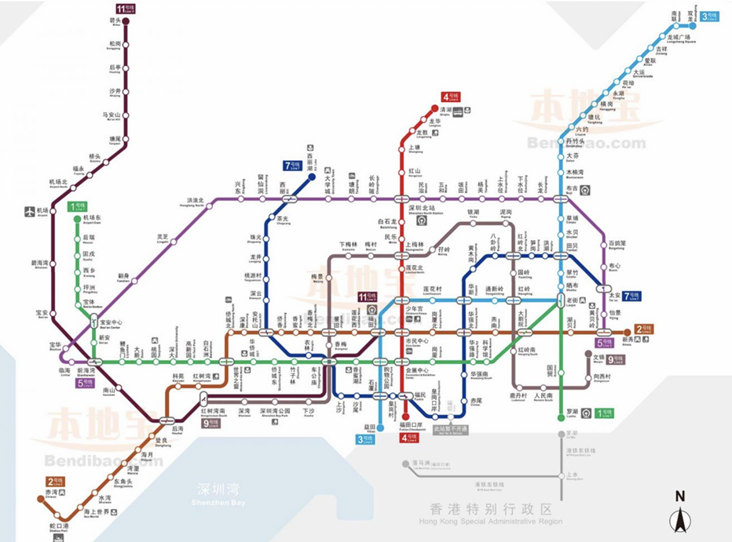

# RIC 选课平台指南

RIC 选课平台是 RIC 为同学开发的选课评论交流网站，大家可以在该平台上查看课程详细信息，查看同学的课程评价，提前排课等功能，是同学们快速了解港大课程的不二之选！

### 1. 登录 RIC 选课平台

点击此处访问 RIC 选课平台官网[（https://richku.com/courses）](https://richku.com/courses)点击右上角登录/注册，使&#x7528;**@connect.hku.hk 邮箱**进行注册 

<figure><figcaption></figcaption></figure>

### 2. 课程搜寻

登录成功后，转到选课平台页面，同学们可以从下方课程列表中点击课程查看详细信息，亦可以通过上方搜索栏搜索指定的课程

.jpeg>)

## 3. 课程详情

点击指定课程后, 即会弹出该课程的详细信息面板, 在此处可以查看课程基本信息, 课程 subclass 信息, 历史学生提交成绩分布, 课程评论等\
在学期结束后, 同学亦可提交自己的成绩区间, 并撰写评价, 为将来想要参加这门课程的同学提供宝贵建议\
**成绩分布仅统计了向选课平台提交成绩的数据, 并不代表该课程的真实分布情况课程评价为同学们个人提交, 不代表 RIC 的观点或立场** 

<figure><figcaption></figcaption></figure>

### 4. 排课表

在排课表中选择一个 subclass 后, 即将该 subclass 添加到了 timetable 中

.jpeg>)

点击网站右下角的悬浮按钮，即可打开 timetable\
在这里你可以看到所有你添加的课程，并检查是否有冲突的课程，帮助你更直观地安排和调整课程 

<figure><figcaption></figcaption></figure>

此外，你还可以在课程详细信息面板的右上角点击 .png>)为已选择 subclass 的课程手动添加 Tutorial 的时间和位置信息，并展示在 timetable 中

**排课表功能旨在为同学们提供便利，在排课表中添加的课程并不代表真正在 HKU Portal 上选择了该课程，请同学们排课后，及时在 HKU Portal 上同步添加**\
**课程信息变动频繁，RIC 会尽快与学校官方同步，但仍可能有一定延迟，请同学们以学校官方为准**\
**有关更多 RIC 选课平台的实用教程，敬请关注【港大 RIC 锐克】微信公众号相关推送。**

***

_Licensed under CC BY-NC-ND 4.0. Copyright © 2026 HKURIC. All Rights Reserved._ _未经许可，禁止演绎、修改或商业用途。_
