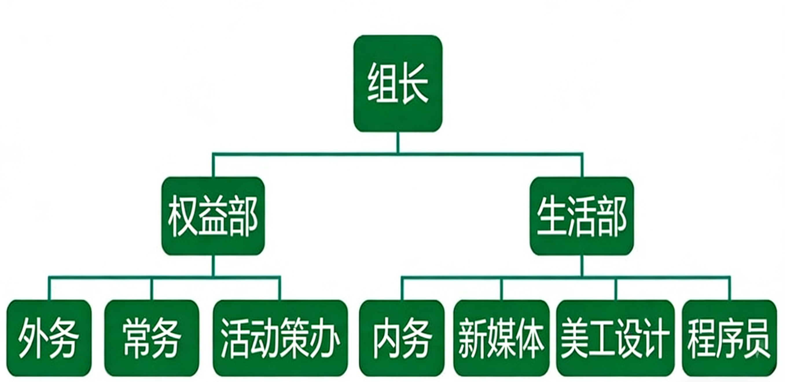

# RIC 介绍

***

同学你好呀！香港大学内地本科生权益保障组 Rights and Interests Committee (RIC) 很高兴与你相遇！我们的职能有：

权益维护 | 学术生活干货分享 | 丰富多彩的福利与活动

欢迎关注我们的微信公众号 **港大 RIC 锐克** 及同名小红书账号，获取更多实用信息，探索精彩港大生活！此外，我们还有 [**RIC 杂货铺** app](https://ricgrocery.richku.com/) 与 [**RIC 选课平台**](https://richku.com/)），内含查看 ddl、搜索课程评价等诸多功能，快来一探究竟！

***

## 一、组织简介

香港大学内地本科生权益保障组（Rights and Interests Committee），简称 RIC，成立于 2010 年 1 月，是一个非政治、非宗教、非盈利的自治学生团体，其执行委员会均为内地赴港就读的本科生，是香港大学最大的内地生社团之一。香港大学内地本科生权益保障组以「保障内地生权益，服务内地生生活」为宗旨开展各项活动，包括但不限于处理权益事件，整合各类信息，开展福利活动，致力于促进信息沟通，优化资源利用，保障正当权益。香港大学内地本科生权益保障组长期与香港大学校内各机构、办公室和学生组织，校外学生组织和商业团体保持良好关系。

## 二、管理架构

香港大学内地本科生权益保障组（RIC）第十五届执行委员会由二十一名执委共同组成，设权益部和生活部。现有职位分别是：组长、外务、常务、内务、活动策办、新媒体、美工设计、程序员。执行委员会内部架构如下:

<figure><figcaption></figcaption></figure>

## 三、RIC 大事记

### 1. 权益类（Advocacy & Welfare）

🏠 住房问题

* 2021 年 6 月：针对租房补贴政策变动，RIC 立即开展问卷调查并联系 CEDARS 等相关方召开紧急庄会，最终通过多方协作争取到现有新政策。
* 2022 年 10 月起：持续跟进黄竹坑 New Hall 事宜，在官方发布前整合关键信息，有效缓解内地生住房焦虑。
* 2024 年 3 月：跟进 Readmission 新政策 "P-1"，及时同步动态并积极与校方沟通，全力维护内地本科生权益。

🍴 食品安全

* 2021 年 - 2024 年：RIC 多次（2021.10 / 2022.11 / 2023.10 / 2024.03）与 CEDARS 就校园食品安全问题进行专题会议，获得有效反馈，保障同学们的就餐安全。

***

### 2. 信息类 (Information & Digital)

* 微信公众号平台：@港大 RIC 锐克 为内地生提供全方位信息，涵盖「新生来港系列」、校园交换资讯、美食介绍及 HKU 万圣节传说等。
* RIC 选课平台（2015 年上线）：每年持续优化，目前积累了 7,046 条课程信息及 12,640 条课程评论，是 HKUer 选课的首选交流平台。
* RIC 杂货铺 App（2023 年上线）：专为港大学生开发的免费工具，集官方信息、选课平台、ddl 提醒、Moodle 文件预览等功能于一体。
* 小红书官方号（2024 年入驻）：@[港大 RIC 锐克](https://www.xiaohongshu.com/user/profile/61dcea370000000010004b77) 正式进驻小红书，通过图文视频持续更新内地生在港生活点滴。

***

### 3. 活动类（Campus Activities）

* RIC O-tour（每年 9 月）：帮助新生快速熟悉校园环境，融入港大生活。
* 糖水 mini-tour（每年 11 月）：带领同学们走街串巷，寻觅校园周边的地道美味。
* RIC 学术之路（每半年）：为有志于深造的同学提供学术信息、经验分享及交流平台。
* 福利特惠：
  * 2025 年 11 月推出 RIC x Canva 学生优惠计划。
  * 寒暑假联合 Boxful 推出储物优惠计划。

> 注：以上仅为 RIC 精彩瞬间的缩影。更多动态，请关注「港大 RIC 锐克」微信公众号。

***

## 四、加入我们

### 在 RIC，你将获得：

* 实战经验：参与多方会议、策划完整活动、运营 30,000+ 关注量的公众号、搭建精致网页或优化 App 功能。
* 成就感：见证推送信息切实帮助到同学，或通过沟通优化了学校规定。
* 归属感：在陌生的城市遇到一群志同道合的「庄友」，建立深厚友谊。
* 成长平台：RIC 提供施展拳脚的空间，让你那些「超赞的 Idea」真正落地实现。

### 招新信息

* 目标对象：想要为内地本科生维权益、谋福利的你。
* 关注方式：请关注微信公众号「港大 RIC 锐克」。
* 发布时间：招新信息将于 九月 正式发布。

***

_Licensed under CC BY-NC-ND 4.0. Copyright © 2026 HKURIC. All Rights Reserved._ _未经许可，禁止演绎、修改或商业用途。_

 
