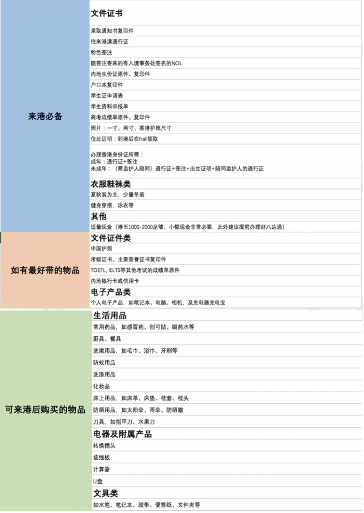

# 新生来港物品清单

上学的日子就要到了，到港之前行李该准备些什么呢？新的来港物品清单出炉啦！在此供各位同学参考。如果你还未做行前准备，可以从头开始读，看看还有哪些要做的；如果你已经整装待发，可以直接跳转到本文的最后部分，查看出发前物品 **Checklist**。**同时，请同学们一定要注意航班托运行李限额，一般航空公司为 23 kg/人，一定要提前规划好，部分物品可以到港后再购置。**

### 一、文件及证件

* 录取通知书\
  港大没有纸质录取通知书，同学可将电子版录取通知书打印。学期开始时学生证还未发放，进图书馆、部分业务办理等都需要出示纸质录取通知书，可以打印一两份备用。不过不必太担心，一般向管理人员出示电子版录取通知书，或下载 HKU App，使用 App 中的电子认证也可通行。
* 往来港澳通行证原件
* 电子版（或打印的纸质版）的入境签证/进入许可通知书、No Objection Letter（NOL，不反对通知书，用于在港实习/工作）
* 内地身份证原件
* 户口本复印件\
  银行开户的时候可能要提交，未成年同学们注意在香港开户一定要至少父母一方陪同。
* 高考成绩单原件、复印件\
  无原件的同学也可通过截图打印等方式获取。部分专业申请数学课时会用到，其他同学也可以带着以防万一。
* 其他考级证书、主要荣誉证书复印件\
  一般复印件就足够，交一些申请时可能会有点用，不过大一可能不太会用到。
* 照片（一寸、两寸及香港护照尺寸 50mm × 40mm）
* 也可以准备一些 55mm × 45mm 的尺寸，基本什么样的尺寸都可以剪出来适用，如果不放心可以多带一些。也可在电脑、电子邮箱或 U 盘、移动硬盘等设备中保留一份原文件，办理学生八达通等的时候会用到，也方便冲洗。
* 住址证明\
  入 Hall 之后可在 Hall Office 领取。办理银行卡、电话卡上台等可能需要。
* 中华人民共和国护照（如有）\
  如果有护照的同学可以带着，出国或去澳门时可以用到。\
  也可以带着过期护照去香港相关部门补办。
* TOEFL、IELTS 等其他考试的成绩单原件（如有）
*   办理香港身份证所需文件\
    成年同学：港澳通行证 + 电子签证\
    未成年同学：（需监护人陪同）香港通行证 + 电子签证 + 出生证明 + 陪同监护人的通行证

    **注**：

    * 上面所有提到的需要带原件的项目，建议复印一份放在家里并且保留一份留存在电脑里；
    * **党团关系**一般保留在原校，或是转至区/街道团委；**档案**建议根据本地情况妥善保存，可以放在所在地的人才服务中心；或是邮寄至位于北京的教育部留学服务中心；或是交由高中保存；或是自行保存。**两种材料均没有必要带到香港**。

### 二、衣物

* 夏装及外套\
  香港从三四月份开始到十月左右都适合穿短袖。但是香港到处都是冷气，特别是港大图书馆、智华馆及黄丽松讲堂，所以一定要记得准备外套哦。
* 春秋装\
  主要是十月、十一月以及二三月份穿，这段时间由短袖逐渐过渡到长袖，再至一件长袖加一件外套。
* 冬装\
  一般两至三件衣服可以搞定，穿一件长袖，一件薄薄的毛衣，一件外套就能顶得住寒冷了，不过最好再带一件羽绒服。香港冬天的最低气温是 10 度左右，最冷会有 5 度，而且冬季风会比较大。棉衣之类的可以在寒假的时候回去再带过来，如果不放心而行李允许的话带过来也无妨。
* 正装\
  对港大同学来说几乎是必备。无论是舍堂 High Table Dinner，还是开学典礼、面试、竞选、晚会、商科 Presentation 等场合都会用到。外套颜色一般是黑色或接近黑色。
  * 男生：配备白色或者浅色衬衫和皮鞋，正式场合还需佩戴领带（冷色成熟稳重，暖色又可以显出一些青春活力），皮鞋以穿着舒适为宜。
  * 女生：白色衬衫加西装上衣，配备裙子或者长裤均可（穿裙子的居多）。也可为 High Table Dinner 再多准备小黑裙。到港再购买也可，较平价的如 G2000，节假日及购物季有折扣，不贵。 另外，建议带一双皮鞋/较正式的鞋子，用于 High Table Dinner 等正式场合。注意，开学典礼（Inauguration Ceremony）等正式场合是不允许穿露出脚趾头的鞋的。
* 睡衣\
  香港本地男生在宿舍里面的装扮一般是一件 T 恤加一件大短裤（篮球裤或沙滩裤），睡觉也是这样穿；女生穿着也是较为宽松随意。所以根据自己需求带就好。
* 运动服装、泳衣等\
  港大有体育馆可以供大家平时做做 Gym、打打球、游游泳，港大为学生提供了体育场、 Gym 和泳池，有需要的同学可以带上自己的运动服装、泳衣等。
* 鞋子\
  可以按照自己的需求和行李的空间携带。

以上所有东西，基本都可以在香港、淘宝买或有空时去深圳买，价格还算可以接受。从家里带花费会少一些，但需要考虑行李大小和重量。近来淘宝等网购平台送货到港愈加方便，同学们不必太担心。

### 三、床上用品

床上用品可自带，也可到港后于学校附近大超市（如西宝城、惠康）以及连锁店日本城或宜家购买。

* 枕头\
  香港枕头主要是软枕，如不习惯建议自带。
* 床单\
  港大 Hall 的床的大小一般是普通单人床 90cm × 190cm（不同 Hall 尺寸不同），自带有床垫。床单可以到港后依据床尺寸大小购买或在家定制差不多尺寸的床单。各 Hall 的具体情况可参考各学生宿舍入住指南。
* 被子\
  不开空调的话，夏天晚上温度 30°C 左右，冬天 10°C 左右。一般需要一床空调被和一床稍厚一点的被子。
* 床垫/褥子\
  港大 Hall 的床垫比较薄和硬，习惯睡软床的同学们可以将床褥子带来，或来港后购买适合的床垫。

**注**：如果要带这些床上用品，可以**真空袋**包装，缩减行李大小。

### 四、生活用品

生活用品可在上述学校附近超市购买，如果行李允许，也可以自带部分。

* 常用药品\
  例如感冒药、创可贴、眼药水、皮炎平，急性胃病用药等。\
  **注**：抗生素类药品在香港需要处方才能购买。若因为身体需要，一定要带抗生素类药品去香港，过关时要向海关申报且需要准备相关的医疗诊断书、本人身份证明、医生处方等，供海关审查。
* 餐具、厨具\
  Hall 内有公共厨房，配有电磁炉、微波炉以及部分公共厨具和调料。也可来港后在超市购买部分常用厨具。
* 杯子或水壸\
  建议带一个便携式水壸，或来港后在附近超市、购物软件等购买。
* 洗漱用品\
  如毛巾、浴巾、牙刷等之类的，可自带也可到校后购买。
* 化妆包、化妆品\
  基本的化妆用具可以在内地配备。至于化妆品, 香港买较为划算。
* 防晒用具\
  如雨伞、阳伞、防晒霜、止汗露、墨镜等。夏天温度高，男生女生都要做好防晒工作。
* 防蚊装备\
  花露水、风油精、万金油, 或电蚊香等, 也可到港购买。
* 钱包、零钱包、卡包\
  到港后，可能会有很多卡（内地身份证、香港身份证、港澳通行证、学生卡、八达通、储蓄卡、信用卡等），所以准备个卡包还是个不错的选择。
* 梳子、镜子\
  Hall 房间内有穿衣镜，可自备随身携带的梳镜。
* 指甲刀、水果刀\
  **注**：高铁禁止携带水果刀；飞机禁止随身携带水果刀，但可以托运。
* 洗涤用品\
  如洗衣液、柔顺剂、肥皂、衣架、洗衣袋等，可带也可到港购买。
* 备用眼镜或眼镜修理装备
* 真空包装袋\
  可以缩减空间也可以防潮防尘，暑期储存物品必备。

## 五、电子产品

* 转换插头\
  香港的插头是三角扁平式（英标）。最好先自备一两个。校内文具店也有售, 不过在开学临近时每天都会很早就被抢光, 建议提前自己准备。
* 接线板\
  在内地或香港买均可, 不过香港价格较贵。
* 电动/手动剃须刀（男生用）
* 闹钟
* 计算器\
  **注**：CASIO fx-82ES PLUS、CASIO fx-991CN X、CASIO fx-999CN CW 等型号的计算器不在港大考试允许携带的计算机型号的列表里。具体要求可以点击 [Approved List of Calculators for Use in University Examinations](http://www.exam.hku.hk/pdf/calculators_list.pdf) 查看（或查看群文件《考试允许使用计算器列表》）。\
  可以购买 CASIO fx-50FH II 或 CASIO fx-3650P II，前者在港大书店及文具店均有销售，后者在内地用淘宝等购买也很方便。二者功能上差不多，前者编程功能操作略方便。
* 个人电子设备\
  如 U 盘、手机\*、相机、iPad、iPod、电子词典、耳机等。\
  **注**：
  * 手机只要不是合约机或者电信专用机，基本都可以在香港使用。但下载香港本地 App 较为方便的是苹果手机（支持 Google Play 的 Android 手机也可）。
  * 携带相机、手机的时候，记得同时将连接线与充电器带上。
* 充电宝及数据线\
  **注**：坐飞机时充电宝**不可托运**！
* 笔记本电脑\
  港大每年都有学生机的优惠，价格比内地便宜很多。如果没有之前专用的，建议到香港后再买。即使不是学生机，在专卖店如百脑汇、丰泽等地方买价格一般也比内地便宜些。
* 辅助存储设备如光盘、SD 卡、U 盘、移动硬盘等。

## 六、文具类

香港的文具较贵，一般的圆珠笔至少 5 元。质量好的笔记本要 40 − 50 元，能准备的建议在内地准备，校内文具店以及学校附近商店超市也有售。

* 圆珠笔、水笔、荧光笔
* 自动铅笔加笔芯、橡皮擦，2B 铅笔
* 学生用尺套装/圆规
* 笔记本\
  不建议带多，比较重。视个人需要。
* 订书机、订书针
* 剪刀、美工刀
* 透明胶布、双面胶布、固体胶

**注**：最需要准备笔，其他的看情况。

### 七、其他

* 个人兴趣所需物品\
  如小提琴，吉他，画笔及其附属品，小说等等。
* 辅助学习的参考书、工具书或中文课本\
  **注**：香港的书籍通常都会比大陆贵不少，一般课本的价格都会在一百至数百港币，有些课本甚至需要上千港币购买，所以直接购买新课本可能会花费较多金钱。\
  在港大，有不少课是不需要用到课本的，老师会把上课需要用到的材料打印下来或者直接把电子版给学生，所以在找课本之前要记得查清楚这门课是否需要课本。\
  关于获得课本，除直接购买之外，可以向上过课的同学购买二手课本或借用，也可以找电子版课本阅读或打印。
* 内地银行卡或信用卡\
  银联卡可以在香港使用，推荐同学们可以办一张家长信用卡的副卡。但是不建议使用内地卡在香港提现，以避免昂贵的手续费用。来港之后可以申请借记卡、信用卡（一般额度 10,000 港币）。
* 现金\
  中国海关规定：旅客携带人民币出境，每人每次不得超过 20,000 元；外币现钞则以 5,000 美元或等值（约 39,000 港币）为无需申报之限。\
  在香港，一般较大型的购物商店和餐饮业者都会接受八达通、信用卡、支付宝、微信等非现金支付方式，只有比较小的店铺会只收现金或八达通。因此，随身携带 1,000 - 5,000 港币的小额现金应该是足够的。\
  另外，一些小店会出于假币、找零等理由不收面额 1,000 港币的纸币，因此不要携带过多 “千元大钞”。\
  注：学费和住宿费是不需要亲自带入香港的，港大的学费和住宿费通常不需要立刻交，开学一段时间后学校和 Hall 会分别发来邮件提醒交学费和住宿费，通常缴费的 Deadline 在 10 月份，所以有充足的时间办理出香港当地的银行卡，到时钱可以直接由内地银行卡汇到香港的银行卡里，用香港的银行卡直接缴费。也可以直接微信或支付宝转入学校账户。
* 食物或调味品 香港虽然美食遍地，但饮食习惯多少与内地不同，所以带些有特色的食物还是很有可能派上用场的，比如老干妈（香港很难买到，适合爱吃辣的同学）、东北大米（适合吃不习惯香港米饭的同学）以及自己家乡的土特产（可用于结识内地生，Hall 内各种小伙伴等）。不过，淘宝等网购也很方便，可以网购到港。\
  **注**：乘坐飞机的同学们需要注意，大部分酱料属于液体，需要托运。

以上所带的物品也可来港后在惠康、百佳、日本城、宜家等地购买。应该以行李大小为首要考虑因素。如果放不下，还是带钱来香港买为好。

下面为行李 Checklist：

<figure><figcaption></figcaption></figure>

***

_Licensed under CC BY-NC-ND 4.0. Copyright © 2026 HKURIC. All Rights Reserved._ _未经许可，禁止演绎、修改或商业用途。_
