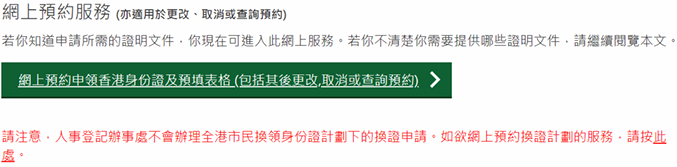
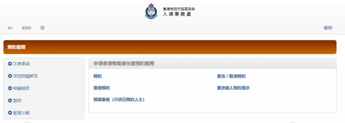

# 如何网上预约香港身份证办理及预填申请表格

<mark style="color:red;">注：现在⽹上预约⾝份证办理名额⼗分紧缺，根据《⼈事登记条例》，除获豁免或⽆须登记</mark>
\ <mark style="color:red;">的⼈⼠外，凡年满11岁或以上的⾹港居⺠（包括获准在⾹港逗留超过180天的⼈⼠），均</mark>
\ <mark style="color:red;">须登记领取⾝份证。年满11岁或以上并获准在⾹港逗留超过180天的新抵港⼈⼠须在抵港</mark>
\ <mark style="color:red;">后的30天内登记领取⾝份证。RIC强烈建议同学们及早进⾏预约。</mark>

<h3 align="center">一、登录香港政府一站通网站</h3>

复制下方链接至浏览器，进入香港政府一站通网站：\
[https://www.gov.hk/tc/residents/immigration/idcard/hkic/bookregidcard.htm](https://www.gov.hk/tc/residents/immigration/idcard/hkic/bookregidcard.htm)

如果觉得看繁体字或英文不便，可将语言调成简体中文。此外，由于在线预约系统需要浏览器 Cookie 打开并将使用 JavaScript，如果后续申请出现无法继续等问题，大家可以调整浏览器设置或更换浏览器重试。

点选"网上预约申领香港智能身份证及预填表格"：

<figure><figcaption></figcaption></figure>

点击“预约”

<figure><figcaption></figcaption></figure>

<h3 align="center">二、在线填写预约信息</h3>

身份证预约共有 5 个步骤，首先在步骤 1 中输入信息。已满十八岁的同学，在申请类别选择中"首次登记身份证（持单程证人士除外）"及"持有效签证/进入许可的新来港人士（就读）"。

<figure><figcaption></figcaption></figure>

如未满十八岁，需选择"首次登记身份证（持单程证人士除外）"及"年满 11 岁申请"。 

<figure><figcaption></figcaption></figure>

在乙部分中选择"其他旅行证件"，并填写港澳通行证信息，只需要填写数字部分的最后六位数字（详情请点击右方的问号查看，如图后半部分）。

<figure><figcaption></figcaption></figure>

根据 Visa 文件中 Notification Slip for Entry Visa / Permit 左上角显示的申请档案编号填写相关信息。 

<figure><figcaption></figcaption></figure>

\
填写完丙丁部分后，点击继续即可。

<figure><figcaption></figcaption></figure>

<h3 align="center">三、确定办理时间及地点</h3>

绝大多数同学会选择离港大最近的湾仔事务处进行办理。但因为同学必须在抵港 30 天内办理身份证, 如果发现湾仔事务处的时间没有空位, 可以尝试选择其他较远的办事处查找空位。 

<figure><figcaption></figcaption></figure>

点击位置、地图等查看办事处具体位置; 点击其他日期查看近期预约情况。 

<figure><figcaption></figcaption></figure>

选定日期后, 选择办理时间段。

确定好预约信息无误后，点击确认提交。 

<figure><figcaption></figcaption></figure>

最好将步骤 5 中显示的预约详情存一份备用。

至此，身份证办理预约部分已经完成，同学们可以选择继续在网上预填申请表或届时到办事处 现场，用其提供的设备进行填写。如何网络预填申请表格见下方（部分内容由于未入境香港，暂时无法填写，需入境后补填）。

## 四、登记表格填写

提交预约后,在步骤 5 中点击绿色按键“开始”进入填写,点击下图中的申请人 1。

<figure><figcaption></figcaption></figure>

<figure><figcaption></figcaption></figure>

申请人需要填写甲和乙部分。甲中的个人资料、香港地址和教育程度须填写。

<figure><figcaption></figcaption></figure>

<figure><figcaption></figcaption></figure>

香港住址需写明地区，校内各堂及第一、第二舍堂村位于中西区半山区；第三舍堂村、青莲台及蒲飞路学生宿舍位于中西区坚尼地城；沙宣道舍堂村位于南区薄扶林；黄竹坑新舍堂位于南区黄竹坑。楼宇名称填写宿舍名称即可。 

<figure><figcaption></figcaption></figure>

乙部的香港居留权特指可以在香港永久居住的权利，因而同学们需要在港逗留条件中选择 "学生"。但是，由于获准逗留日期在未入港前无法确定，需要同学首次使用学生签证入境并拿到 一张写有批准逗留日期的入境小白条（海关人员会将小白条和签证钉在一起），因此同学们可以暂时不填写此处信息，入港后补填。在是否居于香港连续七年或以上中选"否"。丙部不适用 则无需填写，点击"继续"。

<figure><figcaption></figcaption></figure>

下图为入境小白条,红框内为批准逗留日期:

<figure><figcaption></figcaption></figure>

确认所有信息填写无误后，点击最下方的"确定"提交。提交后，可以保存一份预约详情备用。 

<figure><figcaption></figcaption></figure>

<h3 align="center">五、办理提示</h3>

1. 朱满十八岁的申请者需要在父母或其他法定监护人陪同下到事务处进行身份证的申请 **（详情见下方未成年专题）**。
2. 请大家务必按照预约时间前往事务处办理；如果因故无法在预约的时间内出席，在上述网站上更改或取消预约即可，最迟在预约日期的**前一天**更改或取消。
3. 验证预约身份时可以出示最后确认时的表格，也可以提供申请使用的**旅行证件**进行验证。
4. 周六事务处只在上午办公，请同学们在预约办理身份证时注意事务处办公时间。

### 六、未成年专题

香港政府一站通网站上要求未成年人办理香港智能身份证必须有家长/监护人陪同办理。RIC就此事与入境事务处进行了沟通，入境事务处表示如非极特殊情况，还是要求家长/监护人**陪同未成年人到场办理身份证。**

如实在有特殊情况家长/监护人无法到场办理，请家长/监护人联系学校让学校方面指定临时监护人陪同学生办理。申请临时监护人的申请书须包括：

\
1\. "xxx 同学家长 xxx 授权香港大学的 xxx 作为 xxx 同学的临时监护人"\
2\. xxx 的香港身份证号为......\
3."陪同 xxx 同学办理香港智能身份证"\
4\. 家长/监护人签字

**注意：以上授权方式有不予授权或授权不被认可等风险，入境事务处强烈建议各位未成年新生 在家长陪同下办理香港智能身份证**



***

_Licensed under CC BY-NC-ND 4.0. Copyright © 2026 HKURIC. All Rights Reserved._ _未经许可，禁止演绎、修改或商业用途。_
