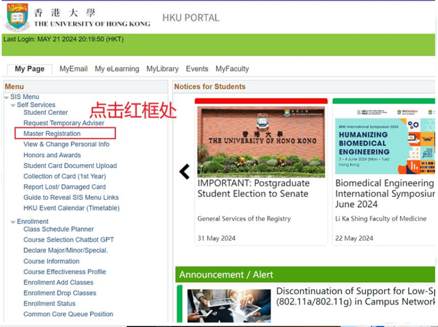
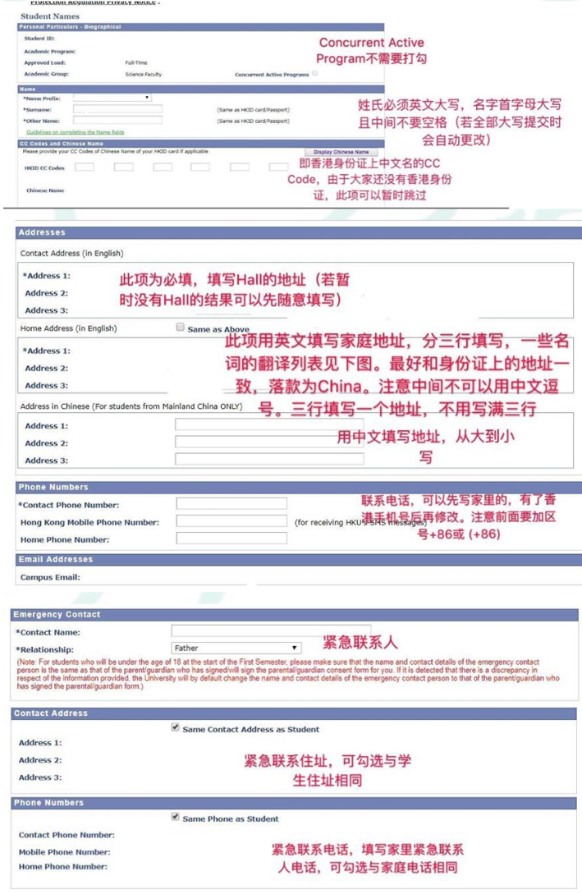

# Master Registration 指南

### 1. 邮件信息

最近部分新生收到了港大发来的关于"Master Registration"的邮件，在完成 Master Registration 之后，同学们便可以开始把个人信息记录到港大的在线系统（Portal）中了。之后选课、查看课程信息、查看成绩等操作都要通过 Portal 进行。\
**这封邮件包含以下内容:**

1. 你的学生证号（UID）：十位，如 3036 xxxxxx
2. 你的初始 Portal 用户名（之后可进行更改）八位，如 u36xxxxx
3. 你的初始 Portal 密码（之后可进行更改）
4. 更改 Portal 用户名和密码的方法

### 2. Master Registration 与 Portal

Master Registration 会激活你的 Portal 账号。Portal 账号是你在港大生活中的重要组成部分，基本上所有在港大的选课和在线学习都要通过 Portal 进行。在取得 Portal 的同时你也将获得自己的以@connect.hku.hk 为后缀的邮箱，开学之后校方信息、课程信息、社团推广等都会通过此邮箱联系你。

### 3. UID 与 Portal 账号的区别

UID 通常是指十位数的学生证号，有时会以 University Number 代指，而 Portal 账号则是指以 uu 开头的八位用户名。很多同学初来港大都会将这两者搞混，在遇到填写信息的时候不知道应该填写哪个，一个简单的区分方法：\
如果你需要在网页或者 APP 上登录账户，填写 8 位 Portal 账号，如果你需要登记你自己的身份信息，填写 10 位 UID。

### 关于 Portal 邮箱

Portal 邮箱即后缀是 @connect.hku.hk 的邮箱，它是基于 Microsoft 邮箱建立的，因此请前往[ Outlook 官网](https://outlook.office365.com/mail/)登录。

## 4. Master Registration 步骤

### 1. 登录 Portal

点击此处前往 HKU Portal，使用邮件中提供的 Portal 邮箱和 PIN 登录。 

<figure><figcaption></figcaption></figure>

### 2. 点击 Master Registration

<figure><figcaption></figcaption></figure>

## 3. 填写相关信息

每一页填写之后点击“Save & Next”最终确认之后点击“Submit”。

<figure><figcaption></figcaption></figure>

## 4. 注意事项

1. Master Registration 之后七天内请务必完成 Portal 用户名的更改，此后再更改用户名需要缴纳 200HKD。如果不更改的话，只能使用 [u36xxxxx@connect.hku.hk](mailto:u36xxxxx@connect.hku.hk) 这样的名称。(2025.8月后均无法修改）
2. 除了地址、电话及银行账户外，**其他信息均无法修改**，提交前请再三检查（尤其是姓名）。之后若有信息改动，需向 Academic Support and Examinations Section 报告并提供相关信息。
3. 地名翻译参考

| 室/房     | Room                |
| ------- | ------------------- |
| 村       | Village             |
| 号       | No.                 |
| 宿舍      | Dormitory           |
| 楼/层     | F                   |
| 住宅区/小区  | Residential Quarter |
| 甲/乙/丙/丁 | A/B/C/D             |
| 卷/弄     | Lane                |
| 单元      | Unit                |
| 楼/栋     | Building            |
| 公司      | Com./Crop/LTD.CO    |
| 厂       | Factory             |
| 酒楼/酒店   | Hotel               |
| 路       | Road                |
| 花园      | Garden              |
| 街       | Street              |
| 信箱      | Mailbox             |
| 区       | District            |
| 县       | County              |
| 镇       | Town                |
| 市       | City                |
| 省       | Prov.               |

以下是两份学校官方的指南





***

_Licensed under CC BY-NC-ND 4.0. Copyright © 2026 HKURIC. All Rights Reserved._ _未经许可，禁止演绎、修改或商业用途。_
