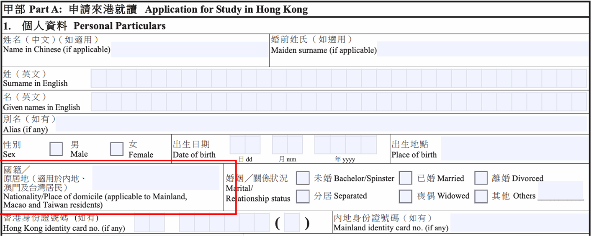
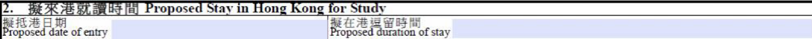
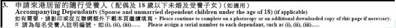
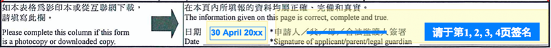
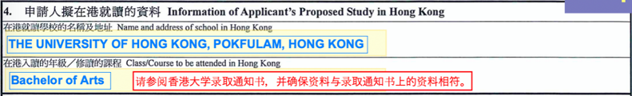
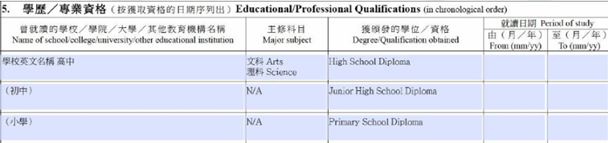
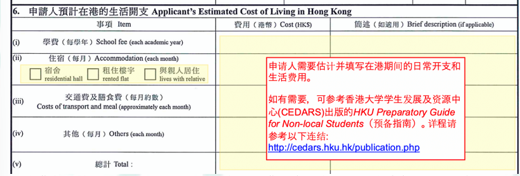
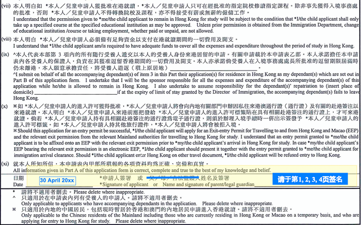

# ID995A表格填写指南

### 填写流程:

1. 在电脑上进行填写（可使用福昕阅读器、Adobe Acrobat Reader 等 PDF 阅读器），打印出来后签名、粘贴相片
2. 或者，打印出来后手动填写、签名、粘贴相片
3. 最好使用大写字母填写

注意：照片必须是贴上去的（不可使用电子照片），也不可使用电子签名

### 上传:

1. 扫描时需保证相片为彩色
2. 一般情况下大部分内地生只需填写、上传并邮寄表格前四页即可
3. 需将前四页合并为同一个小于 10 MB 的 PDF 文件进行上传

### 邮寄:

1. ID995A 表格需寄出原件
2. 所有文件中，ID995A 是唯一一份出错后将原件寄回 AO 的文件（其余文件填错只需重新上传 PDF 即可），所以大家在填写时务必小心核对（在过去几年，常见问题是**容易缺少填写的内容**）。

### 填写指导:

1. 未涉及内容可参考 Sample
2. 所有带有"如有"或"如适用"样的项目均为选填（可以不填）
3. 乙部的全部内容（即第5、6页）和第7页均无需填写，甲部的"3.申請來港居留的隨行受養人"大多数同学都无需填写
4. 带有"×"的项目**需将不适用项划掉**
5. 前四页每页右下角签名处均需签名，16岁以下申请者需让家长签名

## 每个部分详细说明:

### 甲部 Part A:

#### 1.个人资料

#### 应填表格:

<figure><figcaption></figcaption></figure>

### Sample:

.jpeg>)

若已持有港澳通行证，请在旅行證件類別中填写 Exit/Entry Permit for Travelling to and from Hong Kong and Macau(港澳通行证)

并按自己通行证上面的相关信息填写号码、签发地点、日期、届满日期等信息。若尚无通行证或正在办理，这两行可空着不填。

.jpeg>)

每一页只要填写了就需要在页脚处签字\
鉴于大部分学生已满 16 周岁，所以需将/父/母/合法監護人/parent/legal guardian 一并删去，**注意英文也要删去！！！**

### 第二页 PAGE 2

.jpeg>)

* 住址需要填写**英文**，大部分内容写拼音即可
* 照片的尺寸请**严格**按照表上要求，尺寸介于 **50×40 mm−55×45 mm50×40 mm−55×45 mm** 之间，同时可以用剪刀调整一下尺寸大小。扫描及邮寄的版本都**务必确认照片是彩色的、清晰的**

<figure><figcaption></figcaption></figure>

\
申请的留港时间应根据录取通知书填写。

\
建议全日制申请人不要过早入境入港，若须办理入学注册或参与入学迎新活动，申请人可于开学前两周内抵港。因此拟抵港日期在开学前两周-开学日期中挑选，可填写开学前一周的时间（大致即可）。

拟在港逗留時間请根据自己 offer 上的 Programme duration 填写，一般为 **4 years/5 years**

大部分内地生从这里开始就不用再填写 P2 的内容了，留着空白即可

<figure><figcaption></figcaption></figure>

但是 P2 的页脚处同样不要忘记签名及删去不适用

<figure><figcaption></figcaption></figure>

第三页 PAGE 3

<figure><figcaption></figcaption></figure>

这⼀项照这样填就好，修读的课程填写offer上⾯的Study programme

<figure><figcaption></figcaption></figure>

1. 此栏为教育经历部分，请参考以上并根据⾃⼰实际情况填写，⾼中必填，初中和⼩学
   \
   经历可以不填。
2. 注意要求填写学校的英⽂名称。
3. ⾼中若不分⽂/理也可以填N/A。
4. B28同学们的⾼中就读⽇期⼀般是 09/2022—06/2025。

<figure><figcaption></figcaption></figure>

1. 学费每年约 182,000 港元。(由于每年学费会有所变化，具体请参考录取通知书上的 学费数额)
2. 住宿费每年 22,000 至 45,000 港元不等，换算到每月可填写 3,000 港元左右。
3. 交通膳食费及其他总共每月 3,000 至 5,000 港元不等。
4. 总计部分要将单位换算成每年，可填 220,000 港元左右。
5. 简述一般可以不填。

.jpeg>)

* 在 AO 网站注册时选择 **I will support myself** 的同学请填写前两项，即 **Deposit** 和 **Income** 两项。选择 **I have a financial sponsor** (一般是父母)的同学请填写第三项，即 **Others** 这一项。
* 关于 Deposit：如果财产证明的银行存款是在自己名字的账户下面(需要有 10 至 15 万人民币的存款)，请在第一栏 **Deposit Amount** 填写金额数目，简述可填"**applicant's saving**" 或不填。
* 关于 Income：如果获得港大全额奖学金或免学费等其他奖学金，请在第二栏 **Income Amount** 填写奖学金数额(以每年为单位)，并在简述中说明奖学金种类。如果没有获得奖学金可填写 0 。
* 如果是全奖，一般就可以不需要存款证明，即只用填第二栏 **Income**，第一栏 **Deposit**可不填。但如果是免学费及其他奖学金(金额低于全奖)，建议仍然需要准备一定数额的存款证明。每年的奖学金及存款的总额至少要达到要求的数额。但今年也有出现全奖被要求交存款证明的情况，所以建议如果条件允许可以准备一定数额的存款证明。
*   关于 Others：如果财产证明的银行存款是在父母名字的账户下面(同上，需要有 10 至 15 万人民币的存款)，请在第三栏 **Others Amount** 填写金额数目，简述说明 "**sponsored by parents**"。**Financial Proof** 中的账户余额需 ⩾⩾ 填写的金额数。\

    <figure><figcaption></figcaption></figure>
* 在申请前一年内在香港修读了由拥有学位颁授权香港高等教育学院开办的短期课程的同学，请选择 YES 并写明课程名称，修读学校及修读时间，注意用英文填写。
* 否则请选择 NO 即可。
* 签名和日期每页都相同，请划掉无关选项后签名(中文即可)。

## 第四页 PAGE 4

这页按照个人实际情况，该打勾的打勾，该划掉的划掉。签名与日期同上。

.jpeg>)

<mark style="color:red;">注意 (vi) - (x) 需要将带+号的不适用的内容划去。 (中英文都要!)</mark>

<figure><figcaption></figcaption></figure>

## 乙部 Part B:

<mark style="color:red;">P5-P6 不用填写</mark>

\

<figure><figcaption></figcaption></figure>

<mark style="color:red;">P7 不用填写</mark>

#### <mark style="color:red;">最后最后！文末提醒！！！</mark>

1. 检查第二页的照片和签名
2. 检查是否填写第 3 页第 5 部分学校信息及第 7 部分资金赞助金额
3. 检查是否填写第 4 页第 9 部分（i）曾用名（如有）
