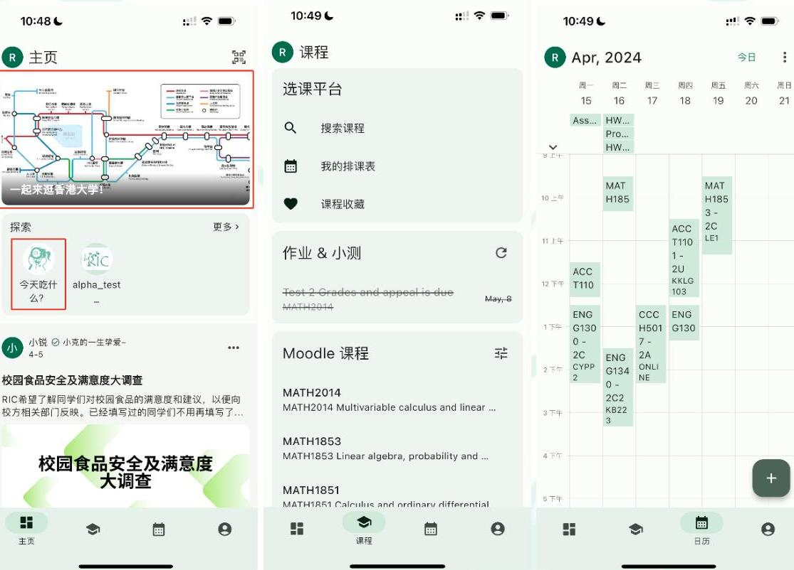

# RIC使用指南

### 一、公众号菜单栏

打开RIC微信公众号 @港大RIC锐克，点击红圈所示"发消息"按钮，找到底部菜单栏（或点击红圈所示"键盘"按钮切换聊天框至菜单栏)\

<figure><figcaption></figcaption></figure>

* 学术生活

开放时间：餐饮设施、图书馆、自习地点、体育设施的开放时间查看链接\
学期时间：学校官方学期时间网站\
学术信息：校园信息、交换、实习毕业、RIC平台的相关推送\
生活信息：住宿、身心健康、时间节点、校园生活、证件办理的相关推送\
活动合集:RIC往期活动的相关推送

.jpeg>)

* 搜索平台:

选课平台：RIC独家选课宝藏神器\
RIC APP: "RIC杂货铺"功能介绍及下载指南\

<figure><figcaption></figcaption></figure>

* 我要维权

权益报告: RIC历年权益年报及权益事件报告\
官方渠道：港大官方维权投诉渠道汇总的推送\
意见建议：对RIC的意见及建议的问卷\
求助RIC:RIC维权信息收录表（需科学上网）\
关于我们:RIC历届执行委员会

.jpeg>)

## 二、公众号聊天框

*   输入关键字获得相关推送\

    <figure><figcaption></figcaption></figure>

如果有任何疑问或想寻求帮助, 也可以通过发信息至公众号, 后台工作人员会尽力解答。

### 三、RIC公众号推文

RIC公众号会持续更新不同类型的推送, 内容包括但不限于校园生活攻略、证件签证申请指南、O-tour以及春季活动等等。RIC还是你的生活小帮手, 会定期提醒各项事情的 deadline时间: 交换申请, hall readmission, 以及租房补贴等等, 每月谈推送也会罗列出每月的重要事件, 提醒你这个月将会发生的事。搜索相关字词, 或发送关键词, 均可在RIC微信公众号获得往期推送。

回复关键词的方法: 见前文"公众号聊天框"部分。\
搜索关键词的方法: 打开RIC微信公众号"港大RIC锐克", 点击右上角放大镜按钮, 输入想要搜索的关键词, 便可收到相关推送。

 (1).jpeg>)

四、维权平台

路径参考前文“公众号菜单栏”部分。RIC开放维权通道给予全体香港大学内地本科生, 并尽\
全力帮助同学们, 积极与校方沟通, 保障全体内地本科生权益。遇到侵权事件不要害怕,\
RIC会是你坚强的后盾!

 (1).jpeg>)

五、RIC选课平台

路径参考前文“公众号菜单栏”部分。

* 功能一: 排课表

.jpeg>)

* 功能二：所有课程的信息及过往学长姐上课感受+评价

搜索并点击自己想要了解的课程，便可以看到过往学长姐们的大致成绩分布，对这门课程内容、work load、教授等的评价，直观了解每门课程的真实样貌。

.jpeg>)

分分钟找到好龟课程以及宝藏Professors和Tutors哦！！

#### 六、RIC杂货铺APP

RIC杂货铺APP包含多个功能，是同学们学习生活的好帮手！

* 主页：

顶部轮播栏会显示近期一些公众号推送

"今天吃什么？"小程序可以随机生成hku校内及附近的餐厅，解决同学们的选择困难症\~

* 课程：

APP支持连接同学们的Moodle账户，从而获取各课程的作业、考试时间，同学们再也不用担心过due了！

* 日历：

RIC杂货铺APP使用教程："RIC 杂货铺"App终于上线了！！！

想要加入我们来一同为内地本科生维权益。谋福利嘛？快快关注我们的微信公众号"港大 RIC 锐克"吧！我们将在九月发布招新信息呦～
