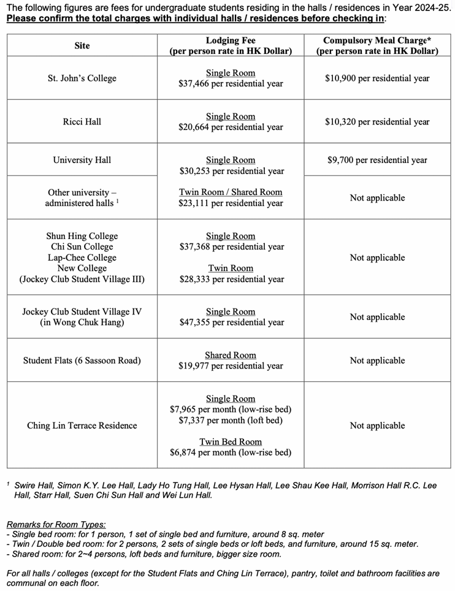

# Hall Charges

> 冷知识，每个宿舍的费用是不一样的。

注：以下为2024-2025收费标准&#x20;

The University of Hong Kong 

Centre of Development and Resources for Students (CEDARS) 

Lodging Fees for Undergraduate Students Residing in Residential Halls, Residential Colleges and CEDARS-administered Residences 

Year 2024~2025

&#x20;IMPORTANT NOTES:

1. Residential Year 2024\~25 would be started from 21 August 2024 to 30 May 2025.
2. If you are a resident of St. John's College, Ricci Hall or University Hall, you MUST join the meal plan of your hall. Please contact the office of your hall for the information and coverage of the meal plan.
3. If you are a resident living in other halls / residences, you can have meals at catering outlets within the campus or nearby your hall. The cost will be at least HK$3,000 per month.
4. Apart from the lodging fee (and the compulsory meal charges for the 3 halls), you will be required to pay some miscellaneous charges such as students' association membership fees, compulsory high table fees, room and/or smartcard deposits, etc. on a semester basis. The total ranges from HK$1,000 to HK$1,500 per semester while some of them may be refundable.\
   In addition, costs for laundry and in-room air-conditioning will be borne by residents. The office of the hall / residence can give you the latest list of charges after you have been offered a place.
5. After moving into the hall / residence in August and January, you will receive invoices of hall charges in October and February respectively from Finance and Enterprises Office of the University via your HKU computer account. You will have to pay by cash (in HK Dollar) or by bank transfer to a HKU bank account (HSBC or Bank of East Asia. They have branches in the Main Campus of HKU).
6. If you wish to stay in hall during the summer vacation (from June to August), you have to contact the office of your hall / residence by April for the application of summer vacation residence.\
   Additional charges will be incurred.

July 2024

<figure><figcaption></figcaption></figure>

https://www.cedars.hku.hk/sections/Accommodation/files/hallcharges.pdf#:\~:text=Apart%20from%20t
he%20lodging%20fee%20%28and%20the%20compulsory,and%2For%20smartcard%20deposits%2C%2
0etc.%20on%20a%20semester%20basis.
